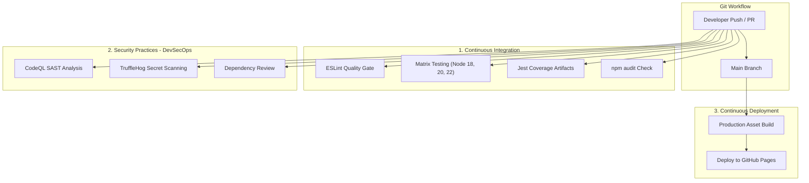

# Enterprise Git & GitHub CI/CD with DevSecOps Workflow


This repository demonstrates an end-to-end automated **CI/CD pipeline** with integrated **Security Best Practices (DevSecOps)** using **GitHub Actions**.

---

## 🏗️ Architecture & Pipeline Overview



---

## 1. 🧪 Continuous Integration (CI)

Located in [`.github/workflows/ci.yml`](.github/workflows/ci.yml), this workflow automatically runs on all `push` events and `pull_request` events to `main`:

- **Automated Matrix Testing:** Tests executed across multiple Node.js runtimes (`18.x`, `20.x`, `22.x`) to guarantee cross-version compatibility.
- **Code Quality & Linting:** Automated ESLint checks to enforce consistent code standards.
- **Test Coverage Reports:** Generates LCOV and HTML test coverage reports with automated GitHub Artifact uploads.
- **Dependency Caching:** Uses `actions/setup-node` caching for fast, reproducible, and deterministic builds (`npm ci`).

---

## 2. 🛡️ Security Practices (DevSecOps)

Located in [`.github/workflows/security.yml`](.github/workflows/security.yml) and [`SECURITY.md`](SECURITY.md):

- **Static Application Security Testing (SAST):** GitHub **CodeQL** scans code for common vulnerabilities, CWE security risks, and insecure patterns.
- **Secret & Credential Scanning:** **TruffleHog** detects leaked tokens, API keys, and sensitive secrets before code is deployed.
- **Dependency Review & Vulnerability Audit:** Blocks vulnerable dependencies via `npm audit` and GitHub's Dependency Review Action on pull requests.
- **Least Privilege Permissions:** All workflows enforce explicit `permissions: contents: read` to prevent privilege escalation.

---

## 3. 🚀 Continuous Deployment (CD)

Located in [`.github/workflows/cd.yml`](.github/workflows/cd.yml):

- **Automated Triggers:** Triggers automatically when code is pushed/merged to `main` (or manually via `workflow_dispatch`).
- **Production Asset Build:** Runs `npm run build` to assemble production assets and live test coverage into `dist/`.
- **Zero-Downtime Deployment:** Uses GitHub Pages deployment with secure OIDC token authentication (`actions/deploy-pages`).

---

## 💻 Local Development & Testing Commands

### Prerequisites
- Node.js >= 18.0.0
- npm >= 9.0.0

### Run Locally
```bash
# 1. Install dependencies
npm ci

# 2. Run unit tests
npm test

# 3. Run unit tests with code coverage report
npm run test:coverage

# 4. Run ESLint code quality checks
npm run lint

# 5. Run dependency vulnerability audit
npm run audit

# 6. Build production package into dist/
npm run build
```

---

## 📁 Project Structure

```
.
├── .github/
│   └── workflows/
│       ├── ci.yml            # CI: Linting, Matrix Testing, Coverage & Audit
│       ├── security.yml      # DevSecOps: CodeQL SAST, Secret Scanning & Dependency Review
│       └── cd.yml            # CD: Automated Deployment to GitHub Pages
├── public/
│   └── index.html            # Web application demo & interactive UI
├── src/
│   └── calculator.js         # Core business logic module
├── tests/
│   └── calculator.test.js    # Comprehensive Jest test suite
├── build.js                  # Production build script
├── eslint.config.js          # ESLint configuration
├── package.json              # NPM dependencies & scripts
├── SECURITY.md               # Security policy & reporting guidelines
└── README.md                 # Documentation
```
